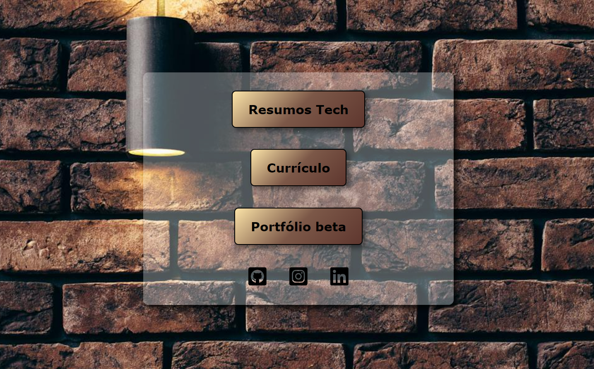

<h1 align="center">HOME</h1>

  Página Inicial com Links Direcionados para Resumos Tecnológicos, Portfólio e Currículo. Além disso, apresenta três ícones que conduzem ao meu perfil no GitHub, onde é possível examinar meus códigos-fonte;
  ao Instagram, onde compartilho regularmente seções de estudos em formato de time-lapse;
  e ao LinkedIn, fornecendo informações mais aprofundadas sobre minhas habilidades e minha visão como profissional.

## Tecnologias Utilizadas

<ul>
 <li>
    Hyper Text Markup Language - HTML5 é a linguagem de marcação que viabiliza a criação de código semântico, de manutenção simplificada e legibilidade
  </li>
  <li>
    Cascading Style Sheets - CSS3, a linguagem de folha de estilo em cascata, é a força motriz por trás da criação de efeitos estéticos na página, englobando a manipulação de textos, imagens e adaptabilidade responsiva.
  </li>
</ul>

## Como Utilizar?

  Simples, basta clicar no item que lhe interessa, e será redirecionado

